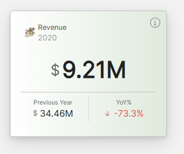
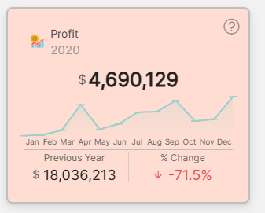

# Modern KPI Card for Qlik Sense

  

**Modern KPI Card** is a powerful, highly customizable visualization extension for Qlik Sense. It goes beyond simple metrics to provide context, comparisons, and trends in a clean, responsive design.

Whether you need a simple number, a comparison against a target, or a complex card with mini-charts and insights, Modern KPI handles it all with style.

---

## 📸 Showcase

### 1. Standard KPI
Clean and professional layout focusing on the main metric with comparison values.

### 2. Bar Chart & Interactive Flip Card
Combine trends with deep-dive storytelling. Click the icon to flip the card for detailed insights.

*(Example shows bar chart integration and interactive flip animation)*

### 3. Line Chart & Conditional Background
Visual context with trend lines and dynamic background colors that react to your data performance.

*(Background dynamically turns red/green based on set thresholds)*

---

## ✨ Key Features
 
 | Feature | Description |
 | --- | --- |
 | **Smart Layouts** | Automatically adapts to any screen size using responsive container queries for optimal readability. |
 | **Comparison Metrics** | Display up to **3 secondary KPIs** (e.g., vs Last Year, vs Target) with dynamic arrows and trend indicators. |
 | **Mini Charts** | Visualize trends directly on the card with **Sparklines**, **Line Charts**, or **Bar Charts**. |
 | **Flip Card Insights** | Interactive "flip" animation reveals detailed descriptions and additional metrics on the back of the card. |
 | **Conditional Styling** | Set colors for backgrounds, values, and text dynamically using powerful Qlik expressions. |
 | **Advanced Formatting** | Full control over number formats including **K/M/B** scaling, **Currency**, **Percentage**, and **Duration** (e.g., `123:45:00`). |
 | **Interactions** | Click actions to navigate to other sheets or open external URLs. |
 | **Export Ready** | Fully supports native **Snapshots**, **Stories**, and **Export to Image/PDF** features. |

---

## 🚀 Installation

### Option 1: Qlik Management Console (QMC)
1.  Download the latest release zip file.
2.  Open the QMC -> **Extensions**.
3.  Click **Import** and select the zip file.

### Option 2: Qlik Sense Desktop / Manual
1.  Unzip the downloaded file.
2.  Copy the `ModernKPI` folder to your extensions directory:
    *   **Desktop:** `C:\Users\<YourUser>\Documents\Qlik\Sense\Extensions\`
    *   **Server:** `C:\ProgramData\Qlik\Sense\Extensions\`

---

## 🛠️ Configuration Guide

### 1. Data Setup
*   **Measures:** Add up to **6 measures** to populate the card in this order:
    1.  **Main KPI Value** (Required)
    2.  **Chart Measure** (Optional - controls the mini chart)
    3.  **Left Comparison** (Optional)
    4.  **Right Comparison** (Optional)
    5.  **Third Comparison** (Optional)
    6.  **X-Axis / Second Series** (Advanced charting)

### 2. Appearance & Styling
Navigate to the **Appearance** tab in the property panel to customize:
*   **Colors:** Background (solid/gradient), Text, Borders, and Shadows.
*   **Fonts:** Adjust sizes and weights for titles, values, and comparisons.
*   **Icons:** Add icons (URL or built-in Qlik icons) to headers or comparison blocks.

### 3. Conditional Logic
Most color properties support Qlik expressions.
*   **Example for Background:** `=If(Sum(Sales) < Sum(Target), '#ffebee', '#e8f5e9')`
*   **Example for Text:** `=If(Sum(Sales) < 0, 'red', 'green')`

---

## 💡 Tips & Tricks

*   **Flip Card:** Enable the "Tooltip / Flip Card" option to hide complex details on the back of the card, keeping your dashboard clean.
*   **Mini Charts:** Use a "Sparkline" for a minimalist trend view, or a "Bar Chart" for precise period comparisons.
*   **Responsive Goals:** The extension is built with CSS Container Queries, meaning it looks great whether it's a tiny tile or a full-screen object.

---

## ❓ Troubleshooting

**Q: My background color isn't changing with the expression.**
*   A: Ensure your expression starts with `=`. For complex logic, try wrapping the color code in single quotes, e.g., `=if(vVal > 0, '#00FF00', '#FF0000')`.

**Q: The chart isn't showing.**
*   A: Make sure you have added a **Dimension** (usually Date or Month) and at least **2 Measures** (Main Value + Chart Value).

**Q: Icons aren't loading.**
*   A: If using external URL icons, ensure your Qlik Sense server (or Qlik Cloud) allows content from that domain in the **Content Security Policy (CSP)** settings.

---

## 📄 License
MIT License - feel free to use and modify!

**Author:** Ala Aldin Hija
**Version:** 2.0.0a **Display Mode**: Comparison KPIs, Mini Chart, Both, or None.
4. Optionally add a **Click Action** (Go to Sheet / Open URL) in the Interactions section.
5. Style with colors, gradients, shadows, and conditional background expressions.

---

### Main KPI
Title, font size/weight/alignment, subtitle, format type, currency symbol, prefix/suffix, title icon, **Auto-Fit Font** toggle.

### Mini Chart
Chart type (Bar / Line / Sparkline), dimension, measure, color, bar width %, line width px, chart height, **second series overlay** with its own measure and color, **value labels**, X-axis labels, sorting, tooltip.

### Comparison KPIs (x3)
Title, measure, format (including "Use Measure Formatting"), prefix/suffix, icon, **Value Color Expression**, **Auto Color by Sign (+/-)**, arrows with custom expression/colors, invert logic, trend text.

### Interactions
On Click: None / Go to Sheet / Open URL (with new tab option).

### Conditional Background
Expression field returning a CSS color (e.g., `=If(Sum(Sales)>100000, '#4CAF50', '#F44336')`). Overrides the static background color.

---

## Measure Index Reference

| Index | Purpose |
|-------|---------|
| 0 | Main KPI |
| 1 | Chart measure |
| 2–4 | Comparison KPIs (1st, 2nd, 3rd) |
| 5 | X-Axis label measure |
| 6 | Second chart series |

---

## Troubleshooting

| Problem | Solution |
|---------|----------|
| Extension not appearing | Check `.qext` is valid JSON. Restart Qlik Sense. |
| KPI shows 0 or blank | Verify the measure expression in a table first. |
| Chart shows one point | Ensure a dimension is added with multiple values. |
| Conditional bg not working | Expression must return a quoted color string (e.g., `'#FF0000'`). |
| Click action not working | Verify Sheet ID from URL or ensure full URL with `https://`. |
| Card shows error state | Open browser console (F12), look for `[ModernKPI]` errors. |

---

**Requires Qlik Sense Desktop or Server.** See [Qlik Extension Docs](https://qlik.dev/extend/) for more.
